# dw_barbershop

Projeto feito durante o evento do flutter chamado "DartWeek".
O evento se encontra na sua 11ª Edição

## Getting Started

Neste projeto foi desenvolvido um app para agendamento de barbearias.

As tecnologias abordadas foram, flutter, e packotes utilizados no projeto. Entre esse pacotes estão: intl, top_snack_bar, dio, asyncstate, validatorless, shared_prefencees... você pode encontrar todos os pacotes utilzados no pubspack.yaml

E é claro o riverpod, onde é pacote principal, onde foi centralizado o estudo, pois foi com ele que foi realizado a atualização de estado a aplicação.

## Desing das tela com o resultado esperado no desenvolvimento

  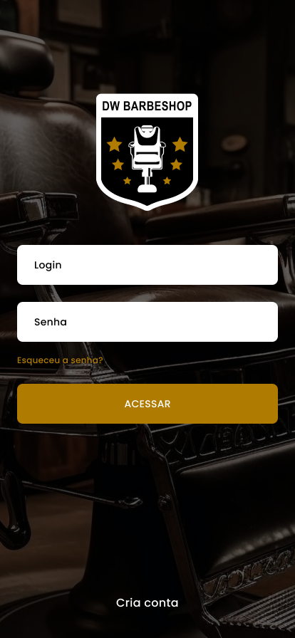
  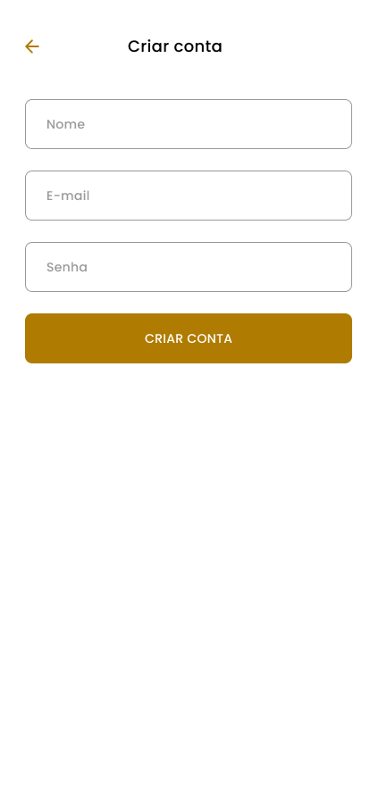
  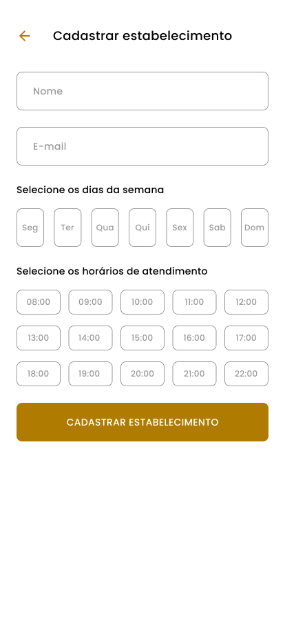
  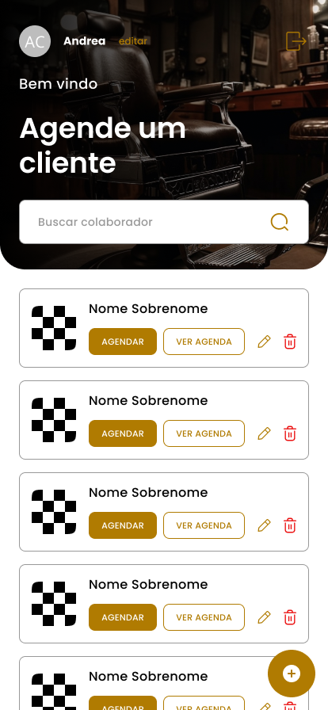
  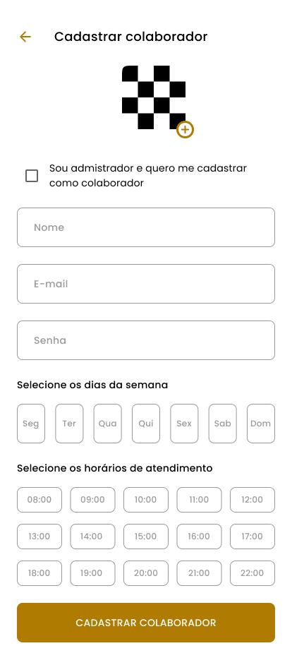
  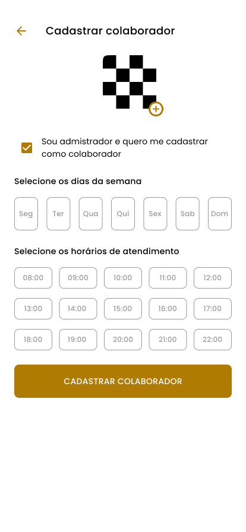
  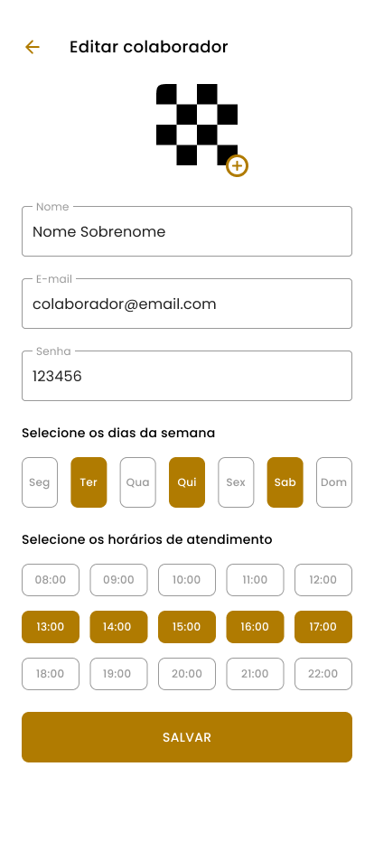
  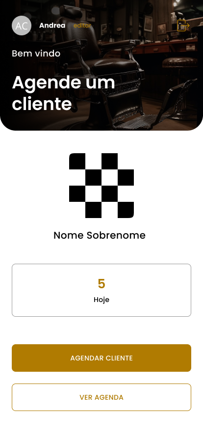
  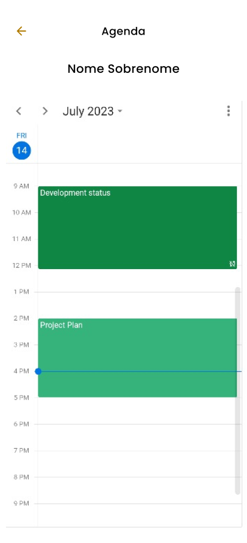
  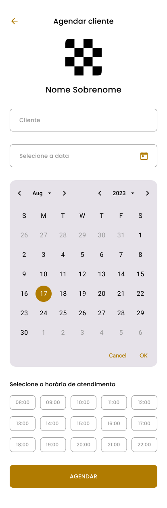
  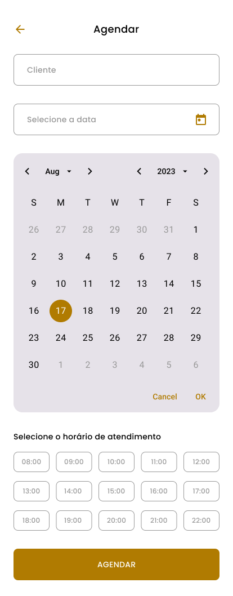
  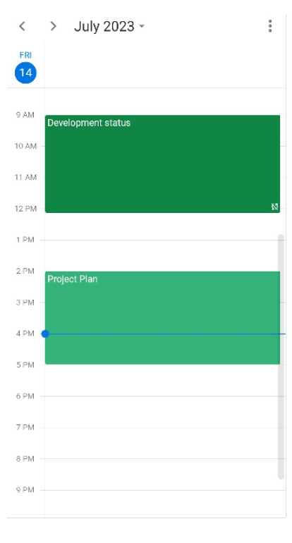

## Mais sobre o evento
O evento ocorre online ministrado por <a href='https://www.youtube.com/@rodrigorahman'> Rodrigo Rahman.<a/>  
O mesmo tem um curso completo de flutter, designado para quem quer aprender a desenvolver a desenvolver apps(Aplicativos) movéis(Celulares, tablets). 
&nbsp;O envento tem um tempo bem desgastante, pois é muito conteúdo para ter se aprender em apenas uma semana, então é bom garantir, e reservar um tempo para se consedir a conlusão. Com video aulas durante o dia, e uma transmissão ao vivo no youtube, durante a noite. Com o resumo do dia e tirar dúcivas dos participantes envolvidos. 
&nbsp; Eu mesmo fiquei estramente cansando nessa edição, pois o as aulas nesta edição chegaram a ter até 3hrs. Isso se transmforma em 4,5,6 horas para quem está estudando, pois temos que pausar, voltar, tentar entender o que está se passando de conhecmento. Eu cheguei a ter um dia inteiro, completo com essa aula, pois tinha outras coisas para fazer. Foi uma semana corrida, mas no final é gratificante ver que você conseguiu aprnder algo, concluir, e receber uma certificação para comprovar sua participação.

## Funcionameto do app resumo
Como já foi falado anteriormente, o objetivo do app(aplicativo) é agendar clientes para barbearia, mas ele tem um fluxo interessante. No aplicativo é possível ter administradores, e colaboradores(funcionários), onde você pode cadastrar(criar) conta de sua barbearia, você mesmo pode se cadastrar como coloborador,e trabalhar, ou simplesmente você pode só ficar na administração e fica como admin.  Você pode adicionar horários de trabalho, e dias da semana que vai prestrar serviço. Depois desse processo, você pode agendar clientes nos dias e horáiro cdastrados.
